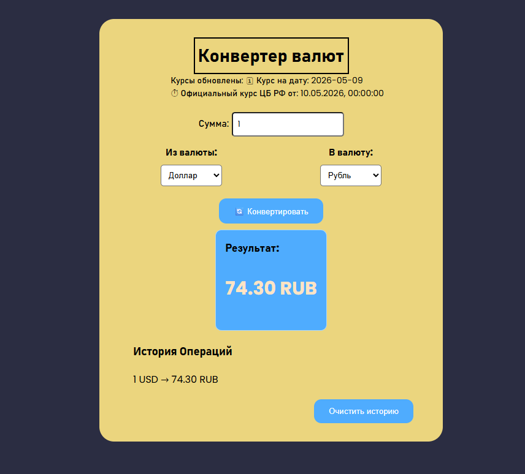

# Конвертер валют

# Конвертер с курсами от ЦБ РФ. Поддерживает 5 валют: RUB, USD, EUR, KZT, UAH.

## Возможности

- Конвертация по курсам ЦБ РФ
- История последних 10 операций (localStorage)
- Очистка истории
- Валидация суммы
- Адаптив (телефоны)
- Enter на поле ввода

## Инструкция по запуску

Для локального запуска проекта выполните следующие команды в терминале:

1. **Клонируйте репозиторий:**
   ```bash
   git clone git@github.com:gtxpit/currencies.git
   ```
2. **Перейдите в папку проекта:**
   ```bash
   cd currencies
   ```
3. **Установите зависимости:**
   ```bash
   npm install
   ```
4. **Запустите проект в режиме разработки:**
   ```bash
   npm run dev
   ```

# Деплой
https://gtxpit.github.io/currencies

# Технологии
HTML / CSS / JS / Vite / Fetch API / localStorage
